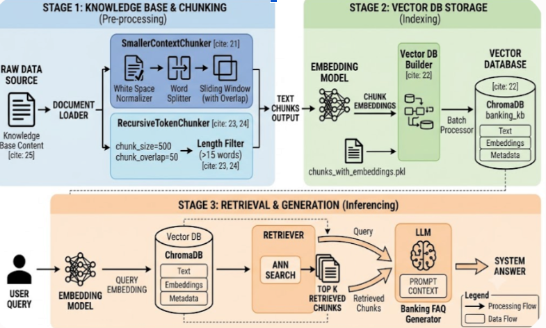

# Intelligent Banking Assistant(RAG Chatbot)-
Team members of 
cache me outside:  
Aseye Ekpe, 
Christopher Obinwa ,
Lebohang Tangu. 
Josh Delos Santos 

<p align="center">
  
</p>

## What is it

A Retrieval-Augmented Generation (RAG) chatbot built for a fictional "HCLTech Bank" that answers customer queries by grounding responses in real banking documents rather than relying purely on the LLM's own knowledge. It handles intent classification, retrieves context from an indexed vector database, persists conversation state via SQLite, builds dynamic user profiles for personalization, and layers in multi-tier guardrails to prevent hallucination and control token spend.

## Architecture



## 🚀 Key Features

- **Multilingual Semantic Search**: Uses sentence-transformers (`paraphrase-multilingual-MiniLM-L12-v2`) to accurately parse and retrieve banking context across multiple languages natively.
- **Dual-Layer Guardrails**:
  - **Semantic Cache**: Instant 0ms duplicate answer lookups using cosine similarity thresholds (≥ 0.95).
  - **Distance Cutoff**: Automated out-of-bounds short-circuiting for off-topic chatter before calling the LLM.
- **Persistent SQLite Tracking**: Thread-safe state tracking that manages both rolling conversation history and stateful user profiles (e.g., preferred account tracking).
- **Enterprise LLM Processing**: Seamless integration with Gemini (`gemini-3.5-flash`) forcing guaranteed structured JSON schema compliance.
- **Secure API Design**: Protected FastAPI endpoints requiring signed, cryptographically valid Bearer JWTs for all operations.

## 🛠️ Tech Stack

| Category | Tools |
|---|---|
| Frameworks | FastAPI, Pydantic, LangChain Core |
| Vector Database | ChromaDB (configured with cosine distance space) |
| Models | Gemini 3.5 Flash (`ChatGoogleGenerativeAI`), SentenceTransformers (MiniLM-L12) |
| Database & Memory | SQLite, SQLAlchemy |
| Security & Language | PyJWT (HS256), langdetect |

## 📁 Repository Structure

```
├── Chunking/
│   └── chroma_db/             # Created automatically on ingestion (cosine metric)
├── LLMInterface.py            # Main architecture (RAG orchestration, cache, profile engines)
├── server.py                  # API controller endpoints (FastAPI routing, JWT auth, guardrails)
├── chat_history.db            # SQLite database file tracking history & caching (auto-generated)
└── README.md                  # Project documentation
```

## ⚙️ Setup & Installation

### 1. Prerequisites

Ensure you have Python 3.10+ installed.

### 2. Environment configuration

Securely set your API tokens and authentication keys as environment variables in your terminal.

**Windows (Command Prompt):**

```dos
set GEMINI_API_KEY=AIzaSyYourGeminiKeyHere
set JWT_SECRET_KEY=your_cryptographically_secure_32_byte_string_minimum
```

**Linux / macOS:**

```bash
export GEMINI_API_KEY="AIzaSyYourGeminiKeyHere"
export JWT_SECRET_KEY="your_cryptographically_secure_32_byte_string_minimum"
```

### 3. Database ingestion setup

Before launching the service, ensure your ingestion script has built a fresh vector database index initialized explicitly with cosine distance metrics:

```python
collection = chroma_client.create_collection(
    name="banking_kb",
    metadata={"hnsw:space": "cosine"}  # Bounds distance between 0.0 and 2.0
)
```

### 4. Run the API server

To start the backend application server listening for incoming UI payload requests:

```bash
python -m uvicorn server:app --reload --port 8000
```

> **Note:** drop `--reload` for demo/production runs — it restarts the server whenever ChromaDB or SQLite files change during normal operation.

## 📡 API Architecture Overview

### 1. Initialize conversation session

**Endpoint:** `GET /api/init-chat`

Returns a securely signed, anonymous guest authentication JWT token to track session state.

**Response:**

```json
{
  "token": "eyJhbGciOiJIUzI1NiIsInR5cCI6IkpXVCJ9..."
}
```

### 2. Stream conversational turn

**Endpoint:** `POST /api/chat`

**Headers required:** `Authorization: Bearer <JWT_TOKEN>`

**Request payload:**

```json
{
  "user_query": "What are the requirements for an SBI savings account?"
}
```

**Response:**

```json
{
  "response": "To open a savings account, you will need...",
  "confidence_score": 0.95,
  "sources": [
    {
      "name": "sbi_savings_faq.pdf",
      "url": "https://sbi.bank.in/web/customer-care/faq-s"
    }
  ],
  "user_profile": {
    "preferred_account_type": "savings/checking account",
    "past_queries": ["What are the requirements for an SBI savings account?"]
  }
}
```

## 🛡️ Integrated Guardrails & Fallbacks

- **Financial harm and ambiguity guard**: If the internal validation framework flags an execution turn with a low confidence score (< 0.2), the response is intercepted and gracefully replaced with a deterministic risk warning message.
- **Out-of-bounds interception**: If a user submits input completely unrelated to banking (e.g., general cooking tips), the query's vector distance trips above `IRRELEVANT_QUERY_DISTANCE_THRESHOLD` (set to 1.0), cleanly returning an immediate out-of-bounds fallback message without incurring unnecessary execution overhead or cloud token costs.
